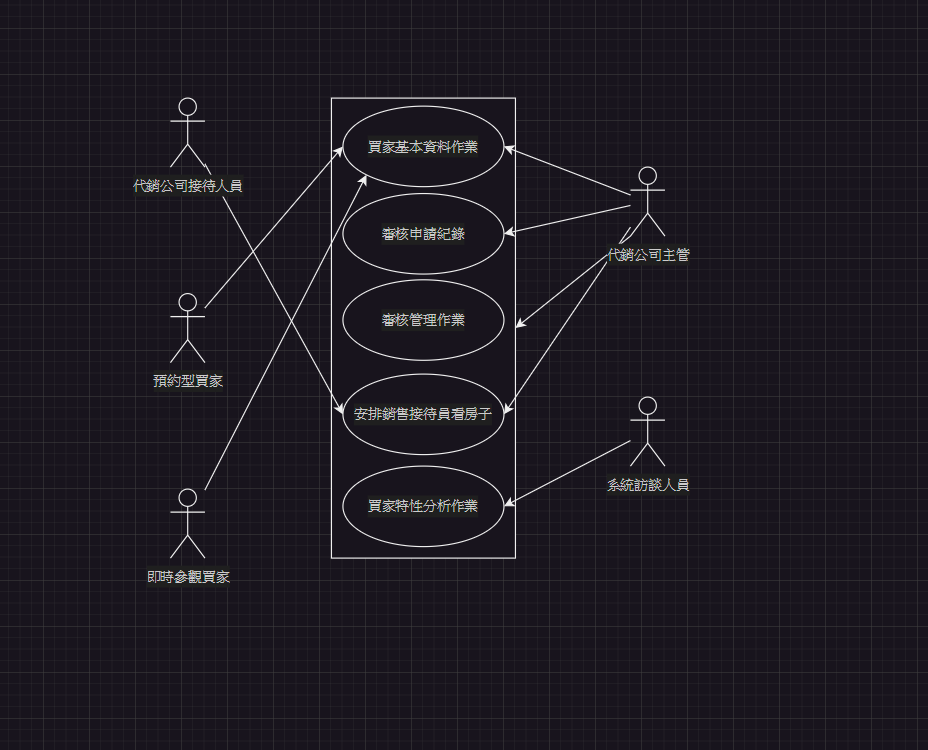
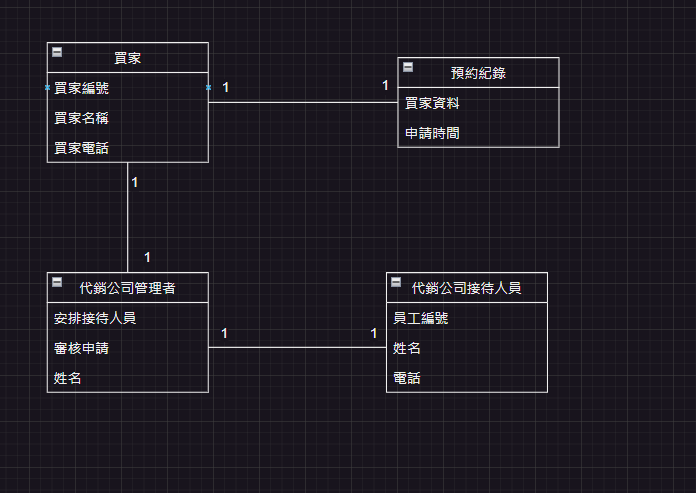
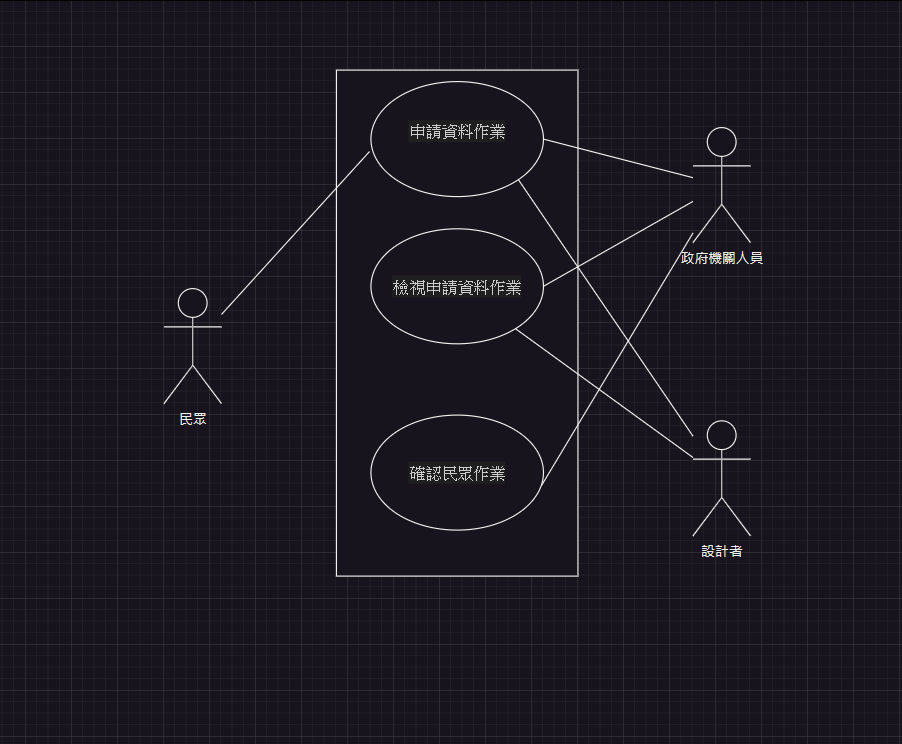
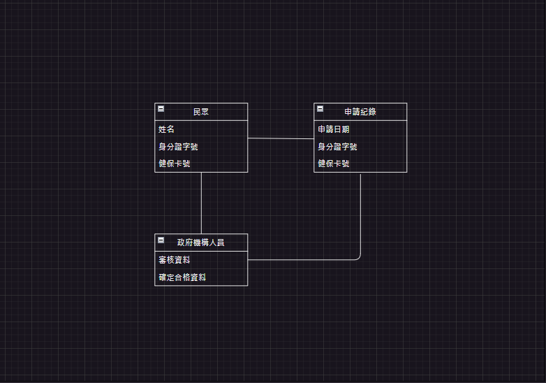

# 期中考-期中-Mid 
<!--(期中標籤註記，該行不能刪，作為驗證標籤，該檔案若沒該份標籤，代表直接貼上saample，直接0分)-->

>
>學號：111111114
> 
>姓名：葉鎧翔
> 

本份文件包含以下主題：(至少需下面兩項，若是有多者可以自行新增)
- [x] 答題

## 答題
>1. 

(a)
「阿力孤代銷公司與綻幣軟體設計」利害人關係表
|利害關係人|目標|
|---|---|
|系統訪談人員|1.能夠進行軟體營運2.提升服務品質3.能夠預防人員疏失|
|代銷公司管理者|1.後台管理2.審核申請3.能夠幫買家安排時程、安排哪位代銷接待人員|
|代銷公司接待人員|1.在安排時間帶顧客看房2.|
|預約型買家|1.於接待中心前48小時進行LINE填寫申請2.買房子並且看房3.尋找自己要的建案資料|
|即時參觀買家|1.點選現場制用LINE填寫申請2.立即有閒置代銷接待員陪同看房3.尋找自己要的建案資料|
事件表
|事件名稱|使用者案例名稱|
|---|---|
|建立與修改作業|買家基本資料作業|
|買家預約|審核申請紀錄|
|查詢與更改|審核管理作業|
|看房|安排銷售接待員看房子|
|能夠進行買家特性分析|買家特性分析作業|
(b)

(c)
|使用案例名稱|客戶基本資料作業|
|使用案例描述|買家申請前填寫的基本資料，幫助代銷管理者安排時間與接待員。|
|主要參與人員|買家、代銷管理者|
|利害關係人與目標|買家:買房子。代銷管理者:審核申請並安排接待員|
|前置條件|買家填寫基本資料|
|後置條件|審核買家基本資料紀錄|
(d)

>2. 

(a)
「政府發放給民眾8000」利害人關係表
|利害關係人|目標|
|---|---|
|民眾|1.申請資料2.領取8000|
|政府機關人員|1.審核通過2.審核民眾資料|
|設計師|1.民眾可以申請2.查看民眾申請|
事件表
|事件名稱|使用者案例名稱|
|---|---|
|能夠讓民眾申請資料|申請資料作業|
|能夠檢視民眾資料|檢視申請資料作業|
|確認申請民眾是否存在|確認民眾作業|
(b)

(c)
|使用案例名稱|申請資料作業|
|使用案例描述|讓民眾申請資料並讓政府機構人員審核確認。|
|主要參與人員|民眾、政府機構人員|
|利害關係人與目標|民眾:獲得8000。政府機構人員:確認民眾身分。|
|前置條件|民眾申請|
|後置條件|審核民眾資料|
(d)
